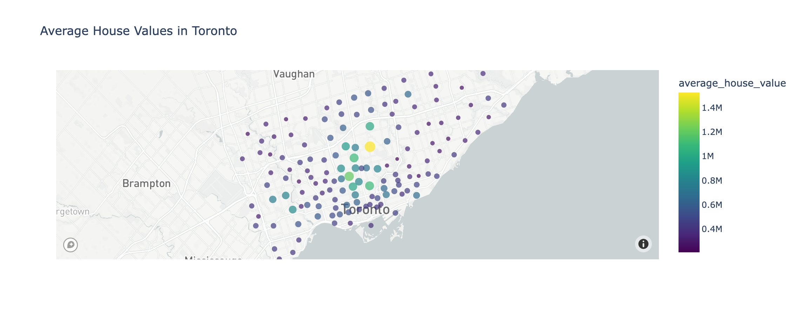
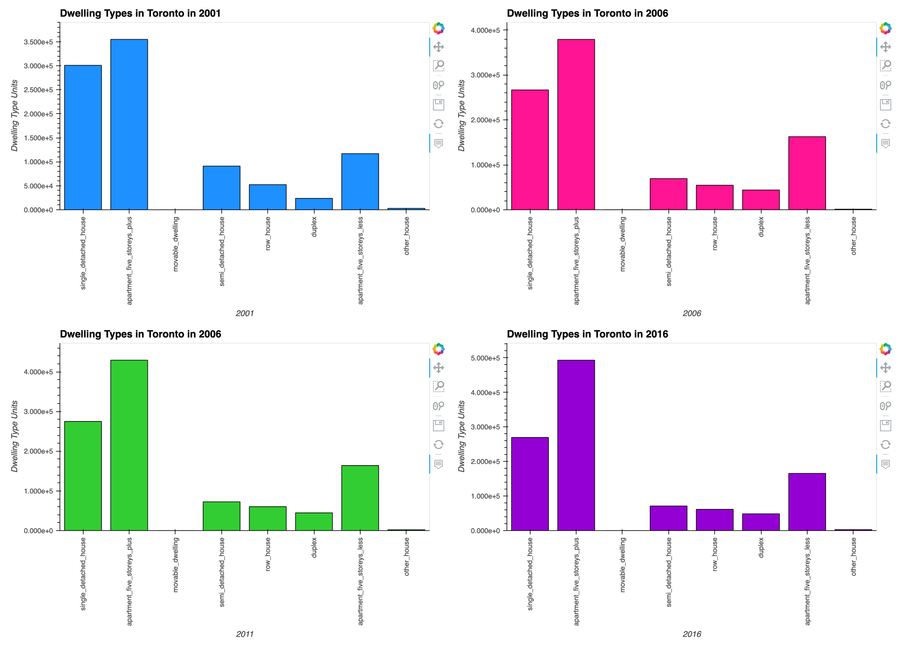
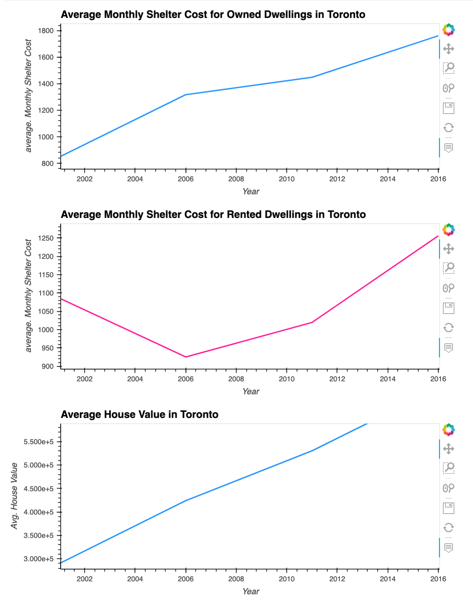
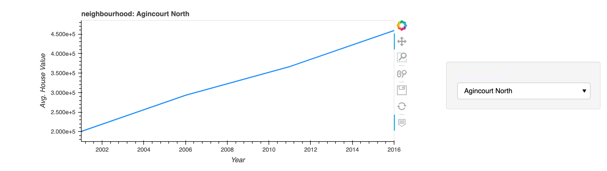
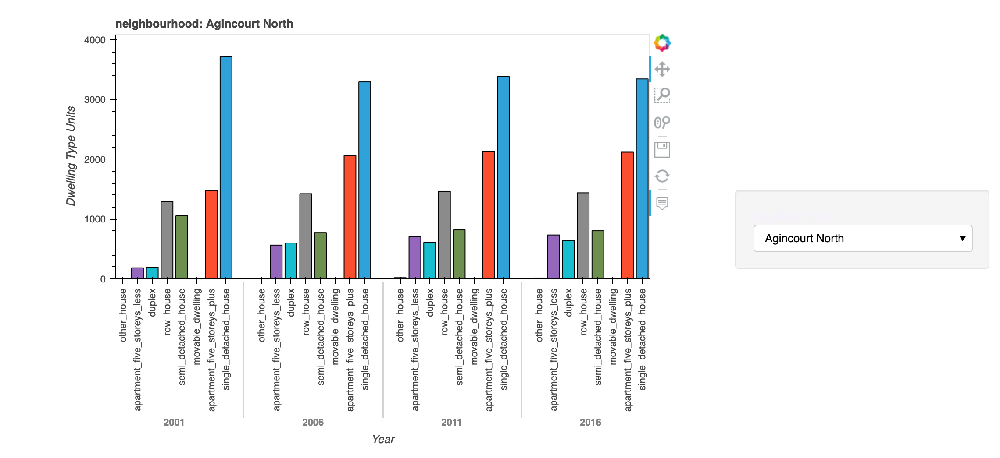
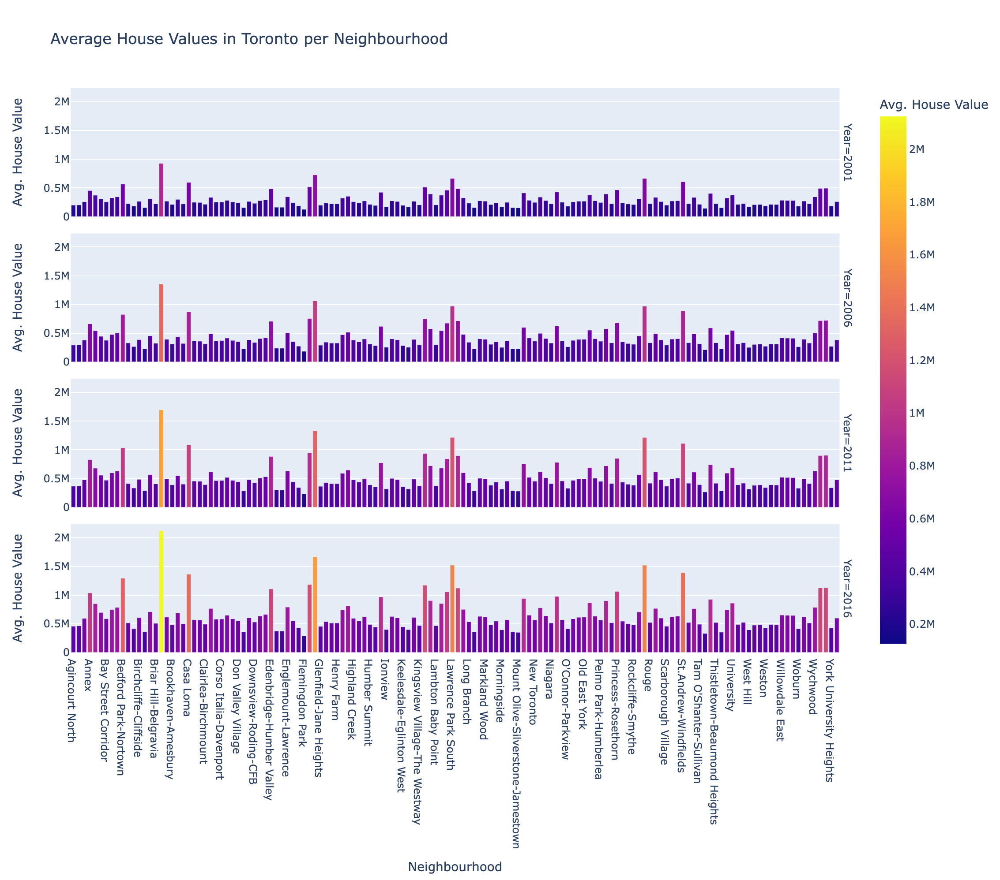
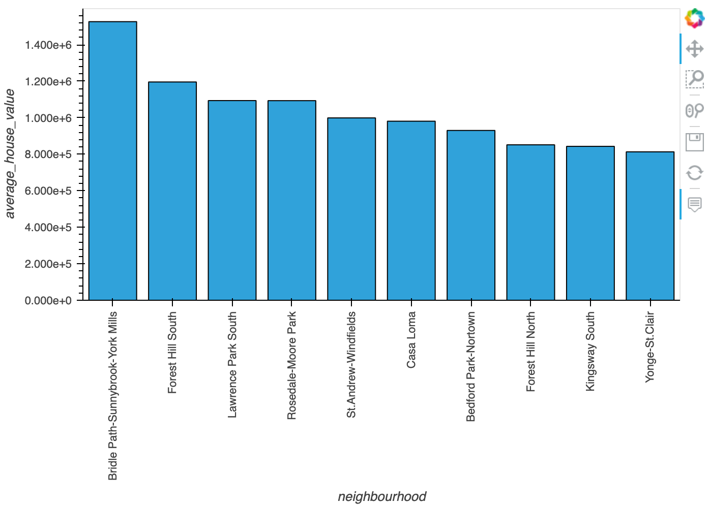
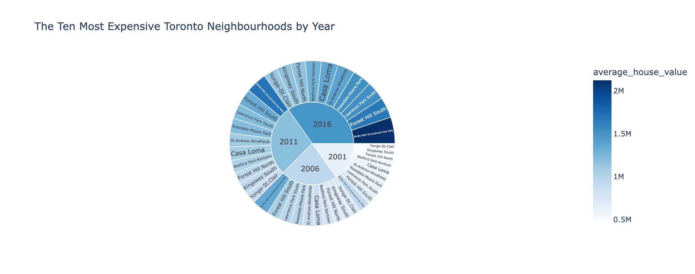

# Toronto Housing Analysis from 2001 to 2016

## Results

### Average House Values in Toronto Overall

Use the map plot to get a birdseye view of the cost of Toronto neighbourhoods. The larger and brighter the dot, the more expensive the neighbourhood. This plot indicates that the most expensive neighbourhoods are near the downtown area.

### Dwelling Type Units per Year

The sum number of dwelling type units per year. The bar heights change as the years go on, indicating which dwelling types gained or lost popularity.

 

### Average Shelter Costs in Toronto Per Year

Comparing the cost of owning a dwelling versus renting one. Notice that although owning a house has been more expensive, the value of houses over doubled.

 

### Neighbourhood Analysis

Use the dropdown menus to look at data for individual neighbourhoods. The data varies widely between each neighbourhood.

 

### Average House Values in Toronto by Neighbourhood

The average house value in each neighbourhood within each time period. Hover over the bars to view more info.

 

### Top 10 Expensive Neighbourhoods Overall

The top 10 expensive neigbourhoods to live in overall between 2001 and 2016.

 

### Top 10 Expensive Neighbourhoods by Year

This sunburst chart displays the top 10 expensive neighbourhoods to live in between 2001 and 2016. Darker colours indicate higher value.

